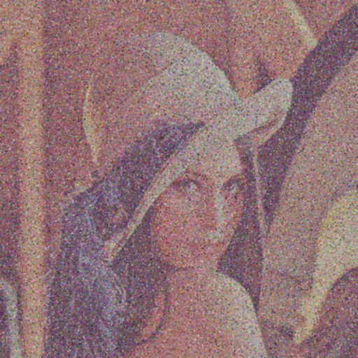

# Image Restoration - MP1

## Nama
Rayyan Fathanza  
NRP: 5024241056

---

## Latar Belakang

Pada tugas ini, saya diberikan citra Lena yang telah mengalami beberapa jenis degradasi, yaitu Gaussian noise, salt-and-pepper noise, blur, dan low contrast. Kombinasi kerusakan ini membuat proses restorasi menjadi cukup menantang, karena setiap jenis noise memiliki karakteristik yang berbeda dan membutuhkan pendekatan yang berbeda pula.

---

## Analisis Awal

Berdasarkan pengamatan saya terhadap citra input, saya menemukan bahwa:

- Noise cukup tinggi dan didominasi oleh Gaussian noise berwarna (grain RGB)
- Terdapat salt-and-pepper noise meskipun tidak terlalu dominan
- Detail citra terlihat kabur akibat blur
- Kontras citra rendah dan warna terlihat kusam

Dari analisis tersebut, saya menyimpulkan bahwa pendekatan yang saya gunakan harus mampu:
1. Mengurangi noise secara bertahap
2. Menjaga keseimbangan antara smoothing dan detail
3. Menghindari peningkatan noise akibat proses kontras atau sharpening

---

## Perbandingan Histogram

### Sebelum


### Sesudah


---

## Pendekatan yang Saya Gunakan

Saya menggunakan pendekatan **multi-stage filtering**, di mana setiap tahap memiliki tujuan spesifik.

### 1. Median Filtering

Saya menggunakan median filter sebanyak dua kali dengan kernel 5x5.

Tujuan:
- Menghilangkan salt-and-pepper noise
- Mengurangi pixel outlier

Saya memilih median filter di tahap awal karena metode ini efektif untuk noise impuls tanpa terlalu merusak edge.

---

### 2. Gaussian Filtering

Setelah itu, saya menggunakan Gaussian filter dengan kernel 7x7 dan sigma 1.8.

Tujuan:
- Mengurangi Gaussian noise
- Menghaluskan citra

Saya menerapkan Gaussian filter setelah median agar noise impuls tidak ikut menyebar.

---

### 3. Smoothing Tambahan

Saya menambahkan Gaussian filtering tambahan dengan kernel 5x5.

Tujuan:
- Mengurangi noise residual
- Membuat hasil lebih halus secara visual

---

### 4. Histogram Equalization (Soft)

Saya tidak menggunakan histogram equalization secara langsung, tetapi menggabungkannya dengan citra hasil smoothing:

Tujuan:
- Meningkatkan kontras
- Menghindari efek over-enhancement

Saya menemukan bahwa histogram equalization penuh justru membuat citra menjadi kasar, sehingga saya menggunakan pendekatan blending.

---

### 5. Sharpening

Saya menggunakan unsharp masking dengan intensitas rendah:

Tujuan:
- Mengembalikan detail yang hilang akibat smoothing

Saya sengaja mengurangi intensitas sharpening agar tidak memperkuat noise yang tersisa.

---

### 6. Reduksi Noise Warna

Saya melakukan quantization sederhana:

Tujuan:
- Mengurangi noise warna (RGB grain)
- Menstabilkan warna

---

### 7. Pemrosesan per Channel

Saya memproses citra secara terpisah untuk setiap channel (R, G, B), kemudian menggabungkannya kembali.

Tujuannya adalah agar noise pada setiap channel dapat ditangani secara lebih spesifik.

---

## Hasil

### Sebelum


### Sesudah


---

## Evaluasi

### Yang Berhasil:
- Noise berkurang cukup signifikan
- Citra menjadi lebih halus
- Warna tetap terjaga
- Tidak terjadi over-sharpening

### Kekurangan:
- Beberapa detail halus hilang akibat smoothing yang cukup kuat
- Hasil belum sepenuhnya menyerupai citra referensi
- Masih terdapat sedikit noise pada beberapa area

---

## Insight yang Saya Dapatkan

Dari proses ini, saya memahami bahwa:

- Tidak ada satu metode yang bisa menangani semua jenis noise sekaligus
- Urutan filtering sangat berpengaruh terhadap hasil akhir
- Histogram equalization harus digunakan dengan hati-hati
- Sharpening yang berlebihan dapat merusak hasil restorasi
- Proses restorasi citra merupakan trade-off antara pengurangan noise dan mempertahankan detail

---

## Cara Menjalankan

```bash
python restoration.py